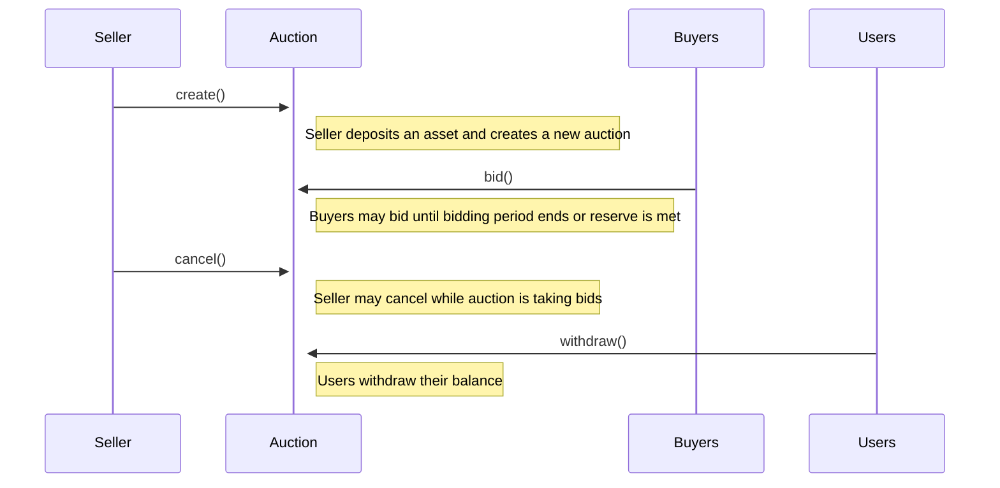

# Fuel-English-Auction

```mermaid
sequenceDiagram
    participant Seller
    participant Auction
    participant Buyers
    participant Users

    Seller->>+Auction: create()
    Note right of Auction: Seller deposits an asset and creates a new auction
    Buyers->>+Auction: bid()
    Note right of Auction: Buyers may bid until bidding period ends or reserve is met
    Seller->>+Auction: cancel()
    Note right of Auction: Seller may cancel while auction is taking bids
    Users->>+Auction: withdraw()
    Note right of Auction: Users withdraw their balance

```
